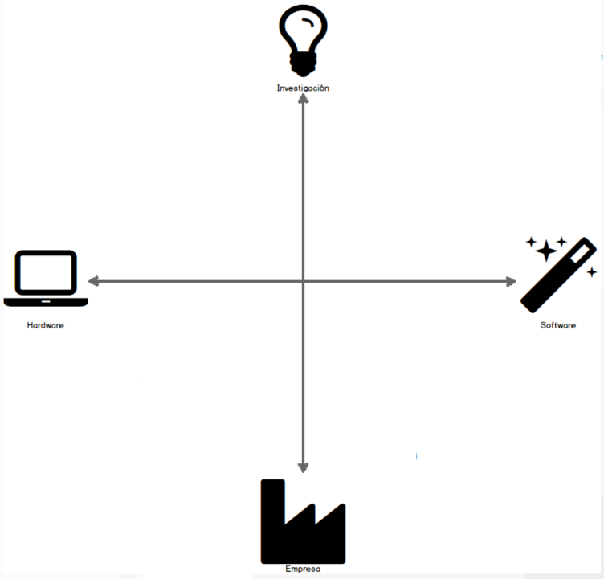
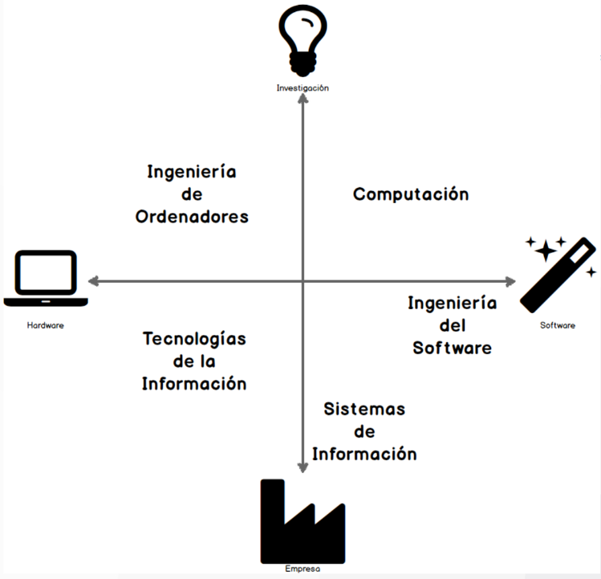
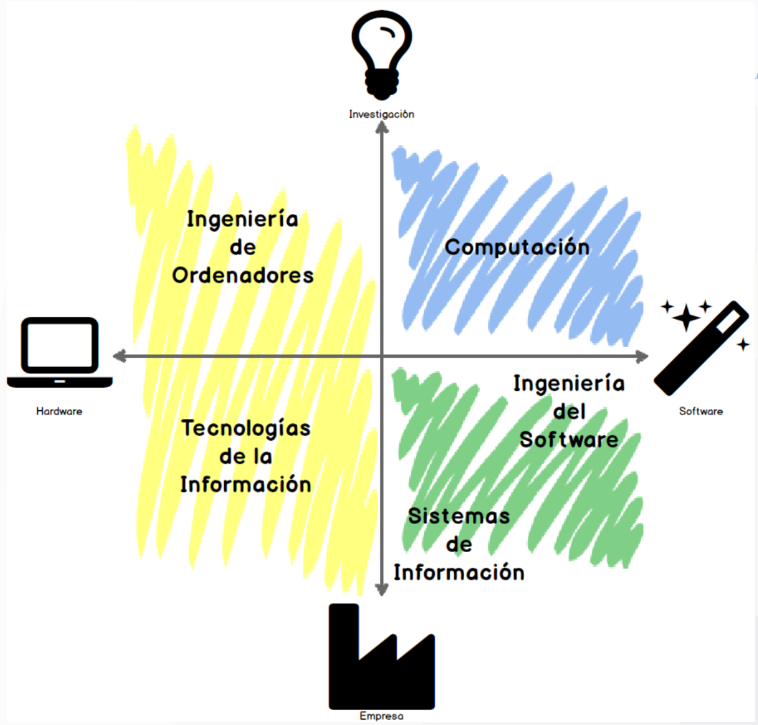

# Ingeniería Informática

## ¿Por qué?

> *En electrónica y en áreas relacionadas de la ingeniería, los conocimientos se duplican entre cada dos años y medio a tres años; así que diez años después de licenciarse, un ingeniero de 32 años se encuentra ejerciendo en un mundo en el que un 80% de los conocimientos que está utilizando han sido descubiertos después de licenciarse…*
> 
> — Frank R Hartley, Cranfield Institute of Technology

Esta cita refleja la rápida evolución del campo de la informática y la necesidad de una formación sólida y adaptable.

- "Copiar código de internet y pegarlo en un sistema para producción es como usar un chicle encontrado en la calle" — Mike Johnson
- "El reto principal de los científicos informáticos es no confundirse con la complejidad de su propia creación" — E. W. Dijkstra
- "Primero resuelve el problema. Entonces, escribe el código" — John Johnson
- "Hay únicamente dos problemas realmente duros en informática: el primero es la invalidación de cachés, y el segundo darles nombres apropiados a las cosas" — Phil Karlton, Netscape

Estas citas subrayan la importancia de la comprensión profunda, el pensamiento crítico y la resolución de problemas en la informática.

## ¿Qué?

|Ciencias de la computación|Ingeniería de ordenadores|Tecnologías de la información|Ingeniería de software|Sistemas de información|
|-|-|-|-|-|
|Fundamentos científicos y técnicos para el diseño de soluciones a los retos de computación|Diseñar ordenadores y dispositivos digitales que integran hardware, software y comunicaciones.|Diseñar e instalar la infraestructura informática necesaria para satisfacer, de forma segura, las necesidades de las organizaciones.|Construir sistemas software gestionando las personas, los recursos y las etapas del proyecto.|Enlazar los ámbitos técnicos y de gestión para mejorar los procesos de las organizaciones con el uso de las TIC.|

|||
|-|-|

## ¿Para qué?

La formación en Ingeniería Informática prepara a los estudiantes para:

- Desarrollar soluciones tecnológicas innovadoras
- Gestionar proyectos de software complejos
- Diseñar y mantener infraestructuras de TI
- Analizar y optimizar sistemas de información
- Investigar en áreas de vanguardia como IA y computación cuántica

## ¿Cómo?

||
|-|

El programa se estructura en cuatro años, combinando teoría y práctica:

1. Ingeniería
2. Programación, estructuras de datos, algoritmos y bases de datos
3. Ingeniería de software, sistemas distribuidos y seguridad
4. Proyectos prácticos, especialización y trabajo fin de grado

||
|-|

### Plan de Estudios

||
|-|

### Metodología de enseñanza

- Clases teóricas y prácticas de laboratorio
- Proyectos en equipo que simulan entornos profesionales reales
- Prácticas en empresas para ganar experiencia laboral
- Trabajo fin de grado para integrar todos los conocimientos adquiridos

### Especializaciones

- Ciberseguridad
- Big data & inteligencia artificial

## Conclusión

El grado en Ingeniería Informática ofrece una formación completa y versátil, preparando a los estudiantes para enfrentar los desafíos tecnológicos del futuro y liderar la innovación en diversos sectores.