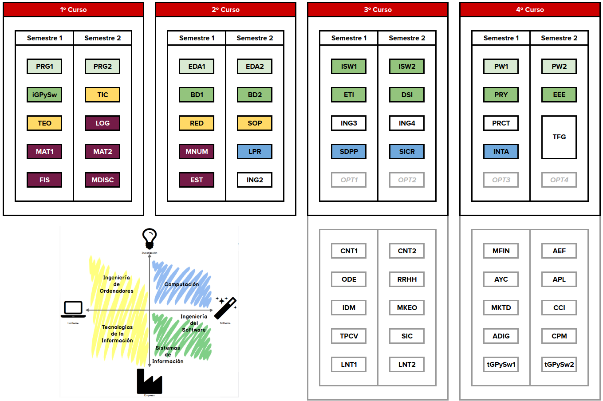

# Ingeniería Informática

## ¿Por qué?

|||
|-|-|
En electrónica y en áreas relacionadas de la ingeniería, los conocimientos se duplican entre cada dos años y medio a tres años; así que diez años después de licenciarse, un ingeniero de 32 años se encuentra ejerciendo en un mundo en el que un 80% de los conocimientos que está utilizando han sido descubiertos después de licenciarse…|Frank R Hartley - Cranfield Institute of Technology

---

|||
|-|-|
Copiar código de internet y pegarlo en un sistema para producción es como usar un chicle encontrado en la calle|Mike Johnson
El reto principal de los científicos informáticos es no confundirse con la complejidad de su propia creación|E. W. Dijkstra
Primero resuelve el problema. Entonces, escribe el código|John Johnson
Hay únicamente dos problemas realmente duros en informática: el primero es la invalidación de cachés, y el segundo darles nombres apropiados a las cosas|Phil Karlton, Netscape

## ¿Qué?

|||
|-|-|
|**Computación**|Fundamentos científicos y técnicos para el diseño de soluciones a los retos de computación en inteligencia artificial, bioinformática, realidad virtual.|
|**Ingeniería de ordenadores**|Diseñar ordenadores y dispositivos digitales que integran hardware, software y comunicaciones.|
|**Tecnologías de la información**|Diseñar e instalar la infraestructura informática necesaria para satisfacer, de forma segura, las necesidades de las organizaciones.|
|**Ingeniería de software**|Construir sistemas software gestionando las personas, los recursos y las etapas del proyecto.|
|**Sistemas de información**|Enlazar los ámbitos técnicos y de gestión para mejorar los procesos de las organizaciones con el uso de las TIC.|

## ¿Para qué?

## ¿Cómo?

### Experto universitario

- Ciberseguridad
- Big data & inteligencia artificial

